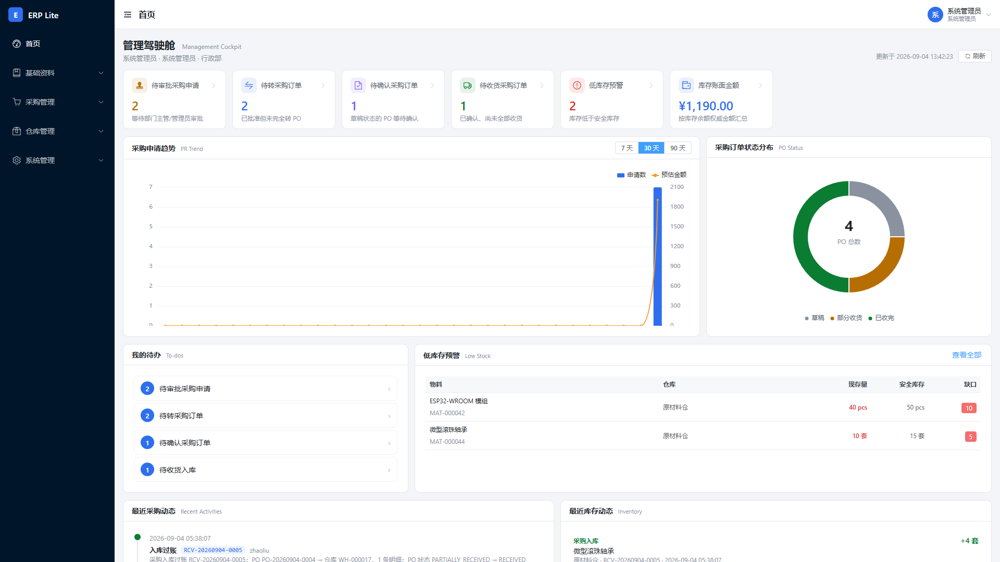
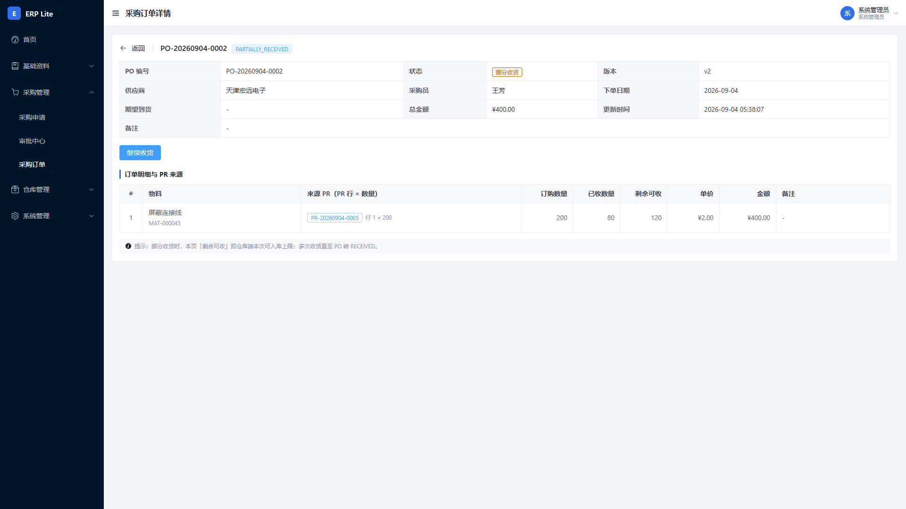
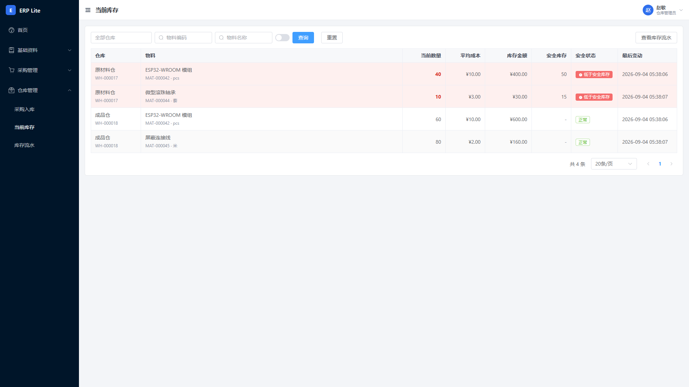

# Manufacturing ERP Lite

**面向制造企业「采购申请 → 审批 → 采购订单 → 收货入库 → 库存」协同场景的轻量 ERP Demo。**

围绕小型研发制造企业的备料与库存管理构建，重点展示：**业务状态机、基于角色的访问控制（RBAC）、事务一致性、并发控制、库存流水账（append-only ledger）与管理看板（Dashboard）设计**。这是一个 Portfolio / Demo 项目，用于展示上述工程能力，不宣称覆盖完整财务 ERP 或生产级全模块 ERP。

---

## 🌐 Portfolio Showcase · 推荐入口

> **无需登录 · 无需启动后端 · 30 秒看完业务闭环，2 分钟看完架构，5 分钟看完 5 个工程挑战。**
> 独立 Vue 3 + TS + Vite 静态站，所有概念动画基于真实业务规则（明确标注）。

| 链接 | 用途 |
|---|---|
| 🟢 **本地访问**：http://localhost:8080/showcase/ | docker compose up 后由同一 Nginx 提供（`/` ERP，`/showcase/` Portfolio） |
| 🟢 **独立构建**：`cd showcase && npm install && npm run build && npm run preview` | http://localhost:5174 |
| 🟢 **README 内精选截图**：[Dashboard](docs/screenshots/02-dashboard.png) · [业务闭环流程图](#业务闭环) | 真实 ERP 1920×1080 渲染 |

> Showcase 内严格区分三类素材：**Real ERP Screenshot**（`docs/screenshots/`） / **Recorded Demo**（待人工录制，方案见 [`docs/recording_plan.md`](docs/recording_plan.md)） / **Concept Animation**（IntersectionObserver + CSS transition，无后端）。

---

## 30 秒速览

| 问题 | 回答 |
|---|---|
| **这是什么？** | 前后端分离的制造企业采购与库存协同系统（Demo），含完整业务闭环与权限体系 |
| **解决什么问题？** | 需求（PR）从提报、主管审批、采购下单（PO）、仓库分批收货到库存记账的全流程协同，杜绝超量入库、超量转单、越权审批与账实不一致 |
| **技术栈？** | 后端 FastAPI + SQLAlchemy 2 + MySQL 8 + Alembic + Pydantic v2 + JWT；前端 Vue 3 + TypeScript + Element Plus + Pinia + ECharts；Pytest / Vitest 测试 |
| **业务闭环？** | PR → Approval → PO → Receipt → Inventory（支持部分到货、冲销、拆单与合单） |
| **技术亮点？** | 单据状态机、RBAC + 对象级权限、乐观锁（Optimistic Locking）+ CAS、事务化库存过账、append-only 库存流水、移动加权平均成本、**库存盘点（三快照 + Snapshot Guard + SoD）**、角色隔离 Dashboard |
| **如何运行？** | 两条路任选：① 本地 `alembic upgrade head` + `init_data` + `uvicorn` + `npm run dev`；② 一键 `docker compose up -d --build` → http://localhost:8080（含 /showcase Portfolio） |

---

## 业务闭环

```
采购申请 PR ──提交──▶ 主管审批 ──通过──▶ 采购订单 PO ──确认──▶ 供应商到货
                                                                     │
                                             采购入库 Receipt（可分批/可冲销）
                                                                     ▼
                         库存流水 Inventory Transaction（append-only ledger）
                                                                     │
                                                    库存余额 Inventory Balance
```

### 真实 ERP 截图（精选 3 张，全部基于 seed_demo 数据）

|  |  |
|---|---|
|  |  |
| **管理驾驶舱**（admin · 6 KPI + ECharts） | **PO 详情**（PARTIALLY_RECEIVED 状态由 `recompute_po_status` 推导） |
|  | |
| **库存余额**（zhaoliu · 低库存高亮 + 加权平均成本列） | |

完整 10 张画廊见 [`docs/screenshots/README.md`](docs/screenshots/README.md) 与 Showcase 网站 `/showcase/#gallery`。

- 采购 100 件 → 到货 40（PO 状态 `PARTIALLY_RECEIVED`）→ 到货 60（`RECEIVED`）——**超量入库被数据库条件更新拒绝**。
- 支持**拆单**（一张 PR 转多张 PO）与**合单**（多张 PR 合并一张 PO），明细级来源映射全程可追溯。

## 技术栈

| 层 | 技术 |
|---|---|
| 后端 | Python 3.12 · FastAPI · SQLAlchemy 2.x · Pydantic v2 · MySQL 8 · Alembic · PyJWT + bcrypt · Pytest |
| 前端 | Vue 3 · TypeScript · Vite · Element Plus · Pinia · Vue Router · Axios · ECharts（按需注册） · Vitest |
| 测试与部署 | Pytest + Coverage（分支覆盖率门禁 70%）· Vitest · Docker / Docker Compose（编排文件就绪） |

## 核心功能

- **主数据**：物料 / 供应商 / 仓库 / 安全库存策略（`warehouse + material` 维度），全部支持停用与启用
- **采购申请 PR**：草稿编辑、提交、取消、驳回后修订（REJECTED → DRAFT 重新编辑）、乐观锁并发保护
- **审批中心**：部门主管审批（`department_managers` 独立关联表），申请部门停用即拒绝审批；ADMIN 越权审批在审计中显式记录
- **采购订单 PO**：仅 APPROVED PR 可转单；来源数量必须严格等于订购数量；确认时强制单价 > 0；未收货才能取消，取消自动回退 PR 已转数量
- **采购入库 Receipt**：无草稿、创建即过账（POSTED）；整单冲销（REVERSED）按**原始入库金额**回滚；入库事务原子：单头 + 明细 + 流水 + 余额 + PO 状态同生共死
- **库存盘点 Stock Reconciliation**：DRAFT → 提交 → 审批即过账（无中间 APPROVED 态）；创建行时固化数量/金额/均价三快照，过账前 **Snapshot Guard**（数量与金额双校验）→ stale 即 `7005` 拒绝并整单回滚；盘盈入账单价后端显式必填（DA-002）；SoD 自审禁止 + ADMIN override 留痕；`ADJUST_IN/OUT` 流水 + 审计同事务；详情见 [docs/stock_reconciliation.md](docs/stock_reconciliation.md)
- **库存**：余额（当前快照）与流水（append-only ledger，MySQL 触发器禁止 UPDATE/DELETE）；`SUM(流水) == 余额` 恒等式可一键对账；移动加权平均成本
- **系统管理**：用户 / 角色 / 权限点分配 / 部门（树形）

## 架构

```
Browser ──▶ Vue 3 ──▶ REST API (/api/v1, JWT) ──▶ FastAPI ──▶ Service 层 ──▶ SQLAlchemy ──▶ MySQL 8
                                                    └──── 状态机 / 事务边界 / CAS / 审计 / 编号（都在 Service）
```

- 分层依赖单向：`api → services → repositories → models`，业务规则全部收敛在 Service 层，API 层只做鉴权与参数校验。
- 详见 **[docs/architecture.md](docs/architecture.md)**。

## 技术亮点（Highlights）

1. **完整业务闭环**：PR → Approval → PO → Receipt → Inventory 全链路真实 API 打通，支持部分到货与冲销
2. **RBAC + 对象级权限（Object-Level Permission）**：路由权限点之外，审批人必须是申请部门主管（`department_managers` 实时查询）、PO 只能操作本人创建、跨部门/跨申请人数据一律 403
3. **单据状态机**：PR / PO / Receipt 三套状态机集中在 Service 层白名单转换，非法流转（如 PENDING 改单、CONFIRMED 回 DRAFT、已收货取消）全部被拒
4. **乐观锁（Optimistic Locking）+ CAS**：PR/PO 带 `version` 条件更新；PR 转单 `converted_quantity` 与收货 `received_quantity` 用「条件 UPDATE + rowcount 校验」，并发下不可能超转/超收
5. **事务化库存过账**：一次收货 = 单头 + 明细 + PO 数量 + 流水 + 余额 + PO 状态 + 审计，单事务提交，任一步失败整体回滚
6. **Append-only 库存流水**：流水创建后禁止 UPDATE/DELETE（MySQL 触发器强制），错误通过反向流水 `PURCHASE_IN_REVERSAL` 纠正，原始记录永留审计链
7. **移动加权平均成本（Moving Weighted Average Cost）**：金额权威（Decimal ROUND_HALF_UP 2 位），平均成本派生展示，冲销按原始金额而非最新均价回滚
8. **角色隔离 Dashboard**：每个 KPI 都有明确口径（如「待转采购 ≠ APPROVED PR 数量」）与数据范围，KPI 下钻与明细列表口径严格一致

## Dashboard（管理驾驶舱）

演示账号登录后左侧「数据看板」：

- **KPI 卡片**：待审批 PR · 待转采购 · 待确认 PO · 待收货 PO · 低库存 · 库存金额
- **趋势/分布**：PR 趋势（7/30/90 天）· PO 状态分布 · 待办清单（按执行角色收敛）· 低库存 Top（按缺口排序）· 最近动态
- **角色视角**：admin 看全景；主管看所管部门 PR；采购员看「待确认 PO / 待收货」；仓库看「待收货 + 低库存」且无 PR 类指标；申请人只看自己的 PR
- 点击 KPI / 待办 / 低库存行可**下钻**到 PR / PO / 库存余额列表（自动带查询条件）

口径定义与易错点见 **[docs/dashboard_metrics.md](docs/dashboard_metrics.md)**。

## 快速开始

### 1. 准备演示数据库（可重复、幂等）

```bash
# 依赖：本机 MySQL 8，库名 erp_lite（测试库自动追加 _test 后缀，见 backend/app/core/config.py）
cd backend
./.venv/Scripts/python.exe -m alembic upgrade head     # 建表 / 迁移
./.venv/Scripts/python.exe -m app.db.init_data        # RBAC + 五角色演示账号（幂等）
./.venv/Scripts/python.exe -m app.db.seed_demo        # 可选：重放确定性业务故事 + KPI 自检（幂等）
```

> `seed_demo` 会**先清空业务数据再重放故事**（演示库专用），产出可解释、与 `tests/test_dashboard.py` 完全一致的确定性结果，不依赖任何 E2E 残留数据。生产/真实数据请勿运行。

### 2. 启动后端

```bash
./.venv/Scripts/python.exe -m uvicorn app.main:app --host 127.0.0.1 --port 8000
# 接口文档：http://127.0.0.1:8000/docs
```

### 3. 启动前端

```bash
cd frontend
npm install
npm run dev          # http://localhost:5173（/api 代理到 127.0.0.1:8000）
```

后端地址由 `frontend/.env.development` 的 `VITE_API_BASE_URL` 配置（默认 `http://localhost:8000/api/v1`，生产同源构建走 `/api/v1` 反代）。

### 4. 演示账号（仅本地演示用）

| 账号 | 密码 | 角色 | 典型操作 |
|---|---|---|---|
| admin | admin123 | 系统管理员 | 主数据 / 系统管理 / 全量审批兜底 |
| zhangsan | demo123 | 采购申请人（研发部） | 创建并提交 PR |
| lisi | demo123 | 部门主管 | 审批中心（通过 / 驳回） |
| wangwu | demo123 | 采购员 | 由 PR 创建 PO 并确认 |
| zhaoliu | demo123 | 仓库管理员 | 收货入库 / 冲销 / 库存查询 |

### 5. 五角色完整演示（全程浏览器）

```
zhangsan 登录 → 新建采购申请 PR → 提交
lisi 登录     → 审批中心 → 通过
wangwu 登录   → 创建采购订单 PO（带 PR 来源）→ 确认
zhaoliu 登录  → 采购入库：第一次收 40 → 库存 40 → 第二次收 60 → PO 已收完
              → 库存余额 100（低库存红标）→ 库存流水 +40/+60
              → 入库单详情 → 冲销第二批（填原因）→ 库存回退 40 → 流水 +40/+60/-60
admin 登录    → 系统管理（用户 / 角色权限分配 / 部门）
```

每次切换账号先退出登录（右上角用户菜单），登录页有演示账号卡片可快速填充。

## 测试（Test Evidence）

> 以下为 **Phase 12 checkpoint** 实测结果，随代码演进可能变化：

| 项 | 结果 |
|---|---|
| 后端 Pytest（含 15 类场景映射 + 端到端业务链测试） | ✅ `229 passed` |
| 分支覆盖率门禁（> 70%） | ✅ 实测 **91%**（`.coveragerc`：`source=app` + `branch=True`） |
| 前端 Vitest | ✅ `47 passed` |
| 前端 TypeScript / 构建 | ✅ `vue-tsc` + `vite build` 通过 |
| 真实 API 冒烟（五角色 Dashboard，Phase 11） | ✅ `smoke_ph11.sh` 35 项断言通过 |
| 迁移一致性 | ✅ `alembic check` 无未生成迁移 |
| **Showcase 构建** | ✅ `cd showcase && npm run typecheck && npm run build`（43 modules · 104KB JS / 16KB CSS · gzip 43KB） |
| **Docker Compose 静态校验** | ✅ `docker compose config` 通过（三服务配置正确，daemon 不可用 → 静态 PASSED） |
| **Docker Compose 实机验收** | ⏸️ **RUNTIME BLOCKED BY ENVIRONMENT**：本机 `wsl.exe` 被安全中心 → 命令安全 → 程序黑名单拦截，Docker Desktop WSL2 引擎无法启动（**不绕过安全策略**）。详见 [docs/deployment.md §2](docs/deployment.md) |

## 项目文档

| 文档 | 说明 |
|---|---|
| [docs/architecture.md](docs/architecture.md) | 架构：分层职责、请求生命周期、为什么业务规则在 Service 层 |
| [docs/business_flow.md](docs/business_flow.md) | 业务流：PR→审批→PO→入库→库存 全链与状态机解释 |
| [docs/quantity_chain.md](docs/quantity_chain.md) | 数量链：requested / converted / ordered / received 字段为何不可合并 |
| [docs/inventory_design.md](docs/inventory_design.md) | 库存设计：流水 vs 余额、对账恒等式、移动加权平均成本 |
| [docs/stock_reconciliation.md](docs/stock_reconciliation.md) | 库存盘点（Sprint 1 / Impl. A）：快照守卫、ADJUST_IN/OUT、SoD、事务边界 |
| [docs/sprint1-inventory-reality-design.md](docs/sprint1-inventory-reality-design.md) | Reality Hardening Sprint 1 设计报告（v2，含 DA-001~007 修订与 Decision Log） |
| [docs/concurrency.md](docs/concurrency.md) | 并发控制：乐观锁 / CAS / 余额行锁 / 统一锁顺序 |
| [docs/transaction.md](docs/transaction.md) | 事务：采购入库原子性与回滚案例 |
| [docs/rbac.md](docs/rbac.md) | 权限：五角色、权限点、对象级权限、单据状态三层模型 |
| [docs/dashboard_metrics.md](docs/dashboard_metrics.md) | Dashboard 口径：KPI 定义、角色可见性矩阵、SQL 口径红线 |
| [docs/demo_script.md](docs/demo_script.md) | 5–7 分钟面试演示脚本（逐步操作 + 讲解点） |
| [docs/interview_qa.md](docs/interview_qa.md) | 项目追问 20+ 问（回答严格基于真实实现） |
| [docs/resume_project.md](docs/resume_project.md) | 简历 / 招聘平台 / 一分钟介绍 三种项目描述 |
| [docs/screenshots/README.md](docs/screenshots/README.md) | 截图清单（10 张真实 ERP · 1920×1080 · 三分类标注） |
| [docs/recording_plan.md](docs/recording_plan.md) | 录屏计划：3 段 webm 人工录制步骤（自动录屏不可用，不伪造） |
| [docs/database-design.md](docs/database-design.md) | 数据库设计：22 张表、约束、索引、枚举 |
| [docs/ERD.md](docs/ERD.md) | ER 图：全局 / 采购库存链路 / RBAC + 状态机附录 |
| [docs/requirements.md](docs/requirements.md) | 需求规格：模块划分、业务流程、规则 R1–R15 |
| [docs/roadmap.md](docs/roadmap.md) | 开发路线图：Phase 0–14 验收记录与决策落地 |
| [docs/data-integrity-review.md](docs/data-integrity-review.md) | 数据一致性评审：11 维度 75 项检查点 |
| [docs/deployment.md](docs/deployment.md) | 部署：Compose 三服务 + Showcase 由同一 Nginx `/showcase/` 提供；环境阻塞说明 |

## 开发进度

| Phase | 名称 | 状态 |
|---|---|---|
| 0–1 | 需求与规划 | ✅ 完成 |
| 2 | 数据库设计 + 数据一致性评审 | ✅ 完成 |
| 3 | 后端基础架构（骨架 + 迁移 + 测试） | ✅ 完成 |
| 4 | 登录与 RBAC（JWT + 权限守卫 + 用户/角色/部门） | ✅ 完成 |
| 5 | 主数据（物料/供应商/仓库/库存策略 + 编号服务） | ✅ 完成 |
| 6 | 采购申请 PR（单据 + 状态机 + 乐观锁） | ✅ 完成 |
| 7 | 审批工作流（部门主管 + 审批记录 + 并发保护） | ✅ 完成 |
| 8 | 采购订单（PR→PO 转换 + 确认/取消 + 数量一致性） | ✅ 完成 |
| 9 | 采购入库 + 库存（Receipt / Transaction / Balance / 冲销） | ✅ 完成 |
| 10 | 前端 Vue 3 全业务链（真实 API，10.1–10.10） | ✅ 完成 |
| 11 | Dashboard 管理驾驶舱（KPI / 趋势 / 权限隔离 / 口径） | ✅ 完成 |
| 12 | 自动化测试（15 类场景 + E2E 故事 + 覆盖率 91%） | ✅ 完成 |
| 12+ | 文档与作品集（架构 / 业务流 / 并发 / 面试材料，当前阶段） | ✅ 完成 |
| 13 | Docker 部署 + Portfolio Showcase 站（编排 + 真实截图 + 业务链互动 + 测试证据；实机受 wsl.exe 黑名单阻塞 → STATIC PASSED / RUNTIME BLOCKED） | ✅ 完成（静态）/ ⏸️ 实机待环境 |
| S1-A | Reality Hardening Sprint 1 · 库存盘点核（Stock Reconciliation Core：三快照 + Snapshot Guard + ADJUST_IN/OUT + RBAC/SoD + 并发 + 单事务；待 Code Review，未 commit） | ✅ 已实现（待 Review） |

## 设计决策摘录

| 维度 | 决策 |
|---|---|
| 表数量 | 22 张（主数据 10 / 采购 5 / 仓储 4 / 支撑 3） |
| 安全库存 | 独立 `inventory_policies` 表，维度 `warehouse + material` |
| 审批人认定 | 独立 `department_managers` 关联表（不写死 user_id，支持一部门多主管） |
| PR→PO 映射 | `purchase_order_item_sources` 明细级映射，支持拆单与合单 |
| 库存流水 | 带符号 `quantity`，`SUM(quantity)` 可一键对账；append-only 由 MySQL 触发器强制 |
| 冲销 | 独立 `PURCHASE_IN_REVERSAL` 类型（不用 `ADJUST_OUT` 代替）；按原始金额回滚 |
| 并发防超收/超转 | 条件更新 + `rowcount` 校验，禁止「先 SELECT 判断再 UPDATE」 |
| 编号生成 | `ON DUPLICATE KEY UPDATE + LAST_INSERT_ID()` 独立短事务，允许跳号 |
| 金额精度 | `Decimal(18,2)` 权威、ROUND_HALF_UP 服务端计算，客户端金额一律忽略 |
