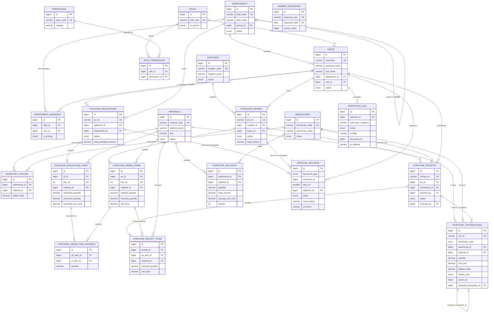
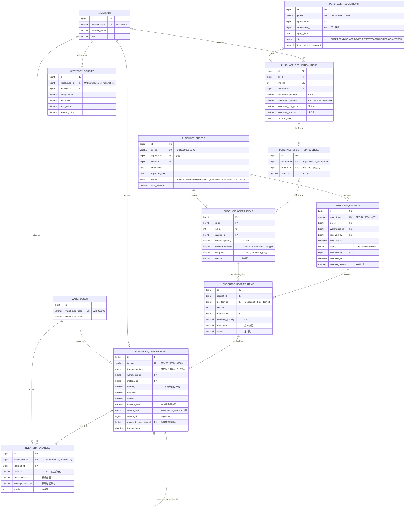
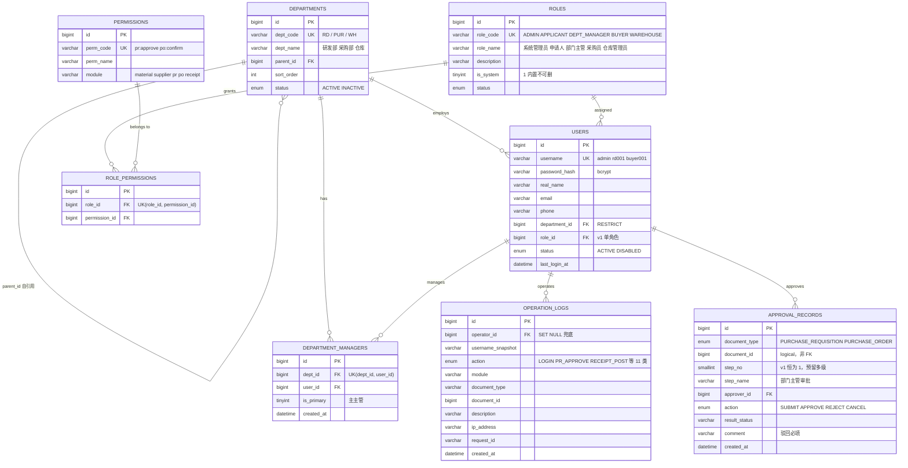
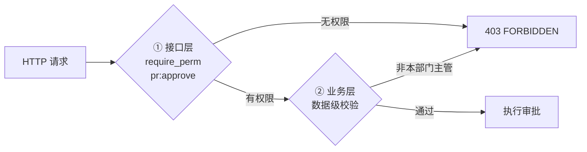
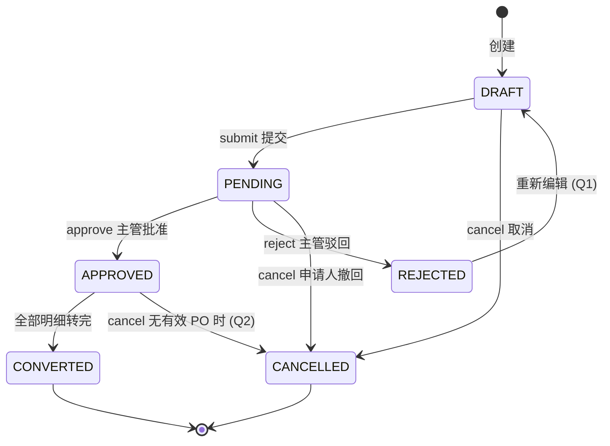
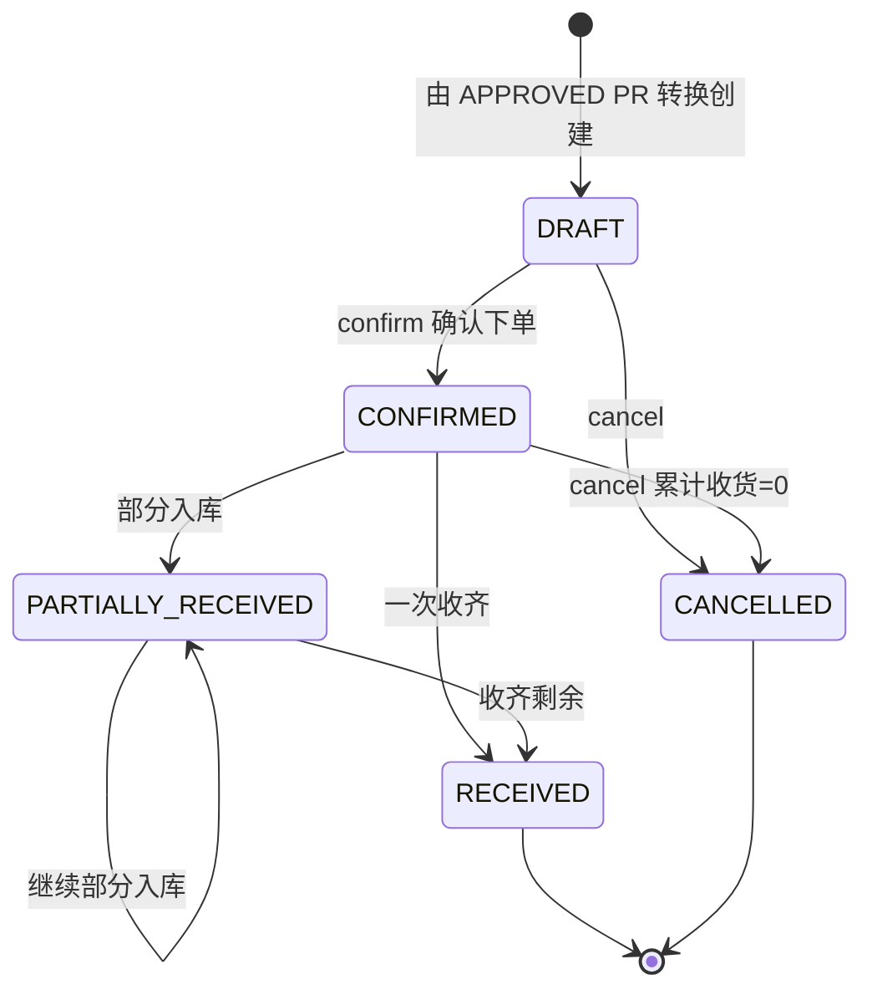
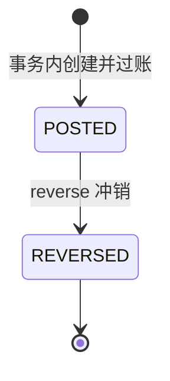
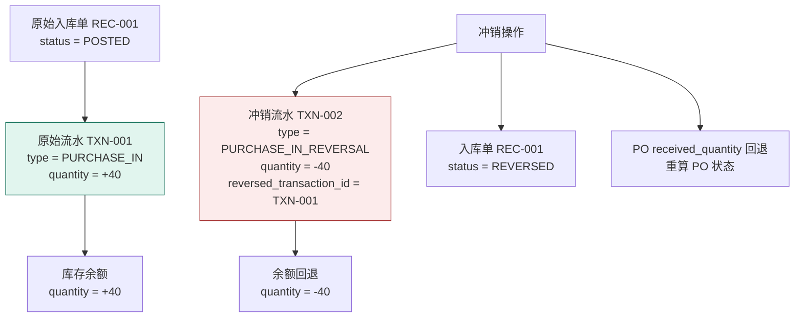

# Manufacturing ERP Lite — ER 图

> 版本：v1.0 ｜ 日期：2026-09-01 ｜ 阶段：Phase 2
> 配套：[`docs/database-design.md`](./database-design.md)（完整字段定义）｜ [`docs/data-integrity-review.md`](./data-integrity-review.md)

---

## 图例

| 符号 | 含义 |
|---|---|
| `||--|{` | 一对多，右侧至少 1 条 |
| `||--o{` | 一对多，右侧可 0 条 |
| `||--o|` | 一对一，右侧可 0 条 |
| `}o--o{` | 多对多（经关联表） |
| `PK` | 主键 |
| `FK` | 外键 |
| `UK` | 唯一约束 |
| `(logical)` | **逻辑关联，非数据库外键**（多态引用，靠业务规则保证完整性） |

> 数量与金额统一 `DECIMAL(18,4)`，图中简写为 `decimal`。

---

## 1. 全局 ERD



---

## 2. 局部 ERD：PR → PO → Receipt → Inventory

业务主干全链路，重点标注数量字段的流转与约束。



### 数量流转不变量

```
pr_item.converted_quantity
    == SUM(po_item_sources.quantity)          按 pr_item_id，排除 CANCELLED PO
    <= pr_item.requested_quantity              DB CHECK

po_item.received_quantity
    == SUM(receipt_items.received_quantity)   按 po_item_id，排除 REVERSED receipt
    <= po_item.ordered_quantity                DB CHECK + CAS

inventory_balance.quantity
    == SUM(inventory_transactions.quantity)   按 (warehouse_id, material_id)
```

---

## 3. 局部 ERD：用户 / 部门 / RBAC



### 权限校验两层模型



**审批人判定 SQL（不写死 user_id）**：

```sql
SELECT 1
FROM department_managers dm
JOIN users u ON u.id = :applicant_id
WHERE dm.dept_id = u.department_id
  AND dm.user_id = :current_user_id
LIMIT 1;
```

| 层 | 校验内容 | 数据来源 |
|---|---|---|
| ① 接口层 | 是否拥有 `pr:approve` 权限 | `users.role_id → role_permissions → permissions` |
| ② 业务层 | 是否为申请人所在部门的主管 | `department_managers` 表 |

> 两层缺一不可：接口层拦不住"有权限但不是本部门主管"，业务层拦不住"完全无权限的用户"。

---

## 4. 附录：单据状态机

### 4.1 采购申请 PR



> `REJECTED` **不能**直接到 `PENDING`，必须先回 `DRAFT` 再提交（Q1）。

### 4.2 采购订单 PO



状态重算规则：

| 条件 | 状态 |
|---|---|
| 所有 Item `received_quantity = 0` 且已确认 | `CONFIRMED` |
| 至少一行 `> 0` 且存在未收齐 | `PARTIALLY_RECEIVED` |
| 所有 Item 全部收齐 | `RECEIVED` |

### 4.3 采购入库单 Receipt



> 无 `DRAFT` 状态：入库是实物操作，创建即生效。无删除路径，只能冲销。

### 4.4 冲销数据流



**三条铁律**：

1. ` PURCHASE_IN_REVERSAL` **不得**用 `ADJUST_OUT` 代替 —— 独立枚举保证业务语义可追溯
2. 原始流水 **禁止** UPDATE / DELETE（append-only 触发器强制）
3. 原始入库单只改状态为 `REVERSED`，**不删除**

---

## 5. 表关系速查

| 父表 | 子表 | 关系 | FK 删除策略 |
|---|---|---|---|
| `departments` | `departments` | 1:N 自引用 | RESTRICT |
| `departments` | `users` | 1:N | RESTRICT |
| `departments` | `department_managers` | 1:N | CASCADE |
| `users` | `department_managers` | 1:N | CASCADE |
| `roles` | `users` | 1:N | RESTRICT |
| `roles` | `role_permissions` | 1:N | CASCADE |
| `permissions` | `role_permissions` | 1:N | CASCADE |
| `materials` | `inventory_policies` | 1:N | CASCADE |
| `warehouses` | `inventory_policies` | 1:N | CASCADE |
| `materials` / `warehouses` | `inventory_balances` | 1:1（联合唯一） | RESTRICT |
| `materials` / `warehouses` | `inventory_transactions` | 1:N | RESTRICT |
| `purchase_requisitions` | `purchase_requisition_items` | 1:N | CASCADE |
| `purchase_orders` | `purchase_order_items` | 1:N | CASCADE |
| `purchase_order_items` | `purchase_order_item_sources` | 1:N | CASCADE |
| `purchase_requisition_items` | `purchase_order_item_sources` | 1:N | **RESTRICT**（防孤儿） |
| `purchase_receipts` | `purchase_receipt_items` | 1:N | CASCADE |
| `purchase_order_items` | `purchase_receipt_items` | 1:N | RESTRICT |
| `inventory_transactions` | `inventory_transactions` | 1:1 自引用（冲销） | RESTRICT |
| `users` | `operation_logs` | 1:N | SET NULL |
| `users` | `approval_records` | 1:N | RESTRICT |

**逻辑关联（非 FK）**：

| 来源表 | 字段 | 指向 | 完整性保证 |
|---|---|---|---|
| `inventory_transactions` | `source_type` + `source_id` | `purchase_receipts` 等 | 源单据禁止物理删除 |
| `approval_records` | `document_type` + `document_id` | PR / PO | 单据进入 PENDING 后禁止物理删除 |
| `operation_logs` | `document_type` + `document_id` | 各类单据 | 日志为历史快照，允许悬空 |

---

*文档结束。Review 通过后进入 Phase 3。*
