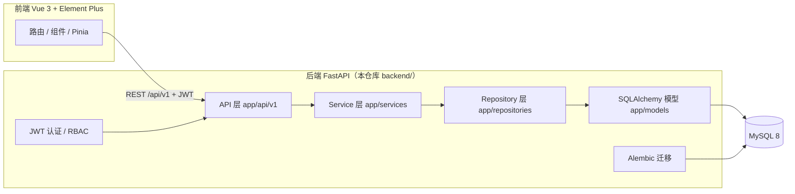

# 系统架构设计（Manufacturing ERP Lite）

> 版本：v1.0 ｜ 日期：2026-09-01 ｜ 阶段：Phase 3 · 后端基础架构

## 1. 总体架构

前后端分离。第一阶段为单体后端 + 单页前端，后续可按域拆分服务。



**依赖方向（单向，禁止反向）**：

```
api → services → repositories → models
              ↘ core / utils（可被任意层引用）
```

## 2. 分层职责

| 层 | 目录 | 职责 | 禁止事项 |
|---|---|---|---|
| API | `app/api/v1/` | HTTP 路由、参数校验（Pydantic Schema）、鉴权依赖、统一响应 | ❌ 修改 `status` 字段、❌ 直接写复杂 SQL、❌ 业务判断 |
| Service | `app/services/` | **全部业务逻辑**：状态机、事务边界、CAS 并发控制、编号生成、审计写入 | ❌ 直接处理 HTTP |
| Repository | `app/repositories/` | 数据访问封装（可选层，v1 保留以支持复杂查询与分页） | ❌ 业务规则 |
| Models | `app/models/` | SQLAlchemy ORM 映射，与 `docs/database-design.md` 1:1 | ❌ 业务方法 |
| Core | `app/core/` | 配置、安全、异常体系、统一响应、异常处理器 | — |
| Utils | `app/utils/` | 枚举、编号工具等 | — |

## 3. 关键技术决策

### 3.1 统一响应与错误码

所有接口返回统一信封：`{code, message, data, request_id}`。

- `code == 0` 成功；`code != 0` 业务错误（见 `app/core/exceptions.py` ErrorCode，按域分段：1xxx 通用 / 2xxx 认证 / 3xxx 主数据 / 4xxx 采购申请 / 5xxx 采购订单 / 6xxx 入库库存）
- HTTP 状态码表达语义类别（401/403/404/409/422/500），`code` 表达精确业务原因
- 全局异常处理器统一转换 `AppException` / Pydantic 校验 / IntegrityError / 未捕获异常

### 3.2 事务边界（架构规则 4）

Service 层使用 `session_scope()` 上下文管理器：

```python
with session_scope() as db:
    # 校验 PO → 创建 Receipt → 更新 received_quantity →
    # 创建流水 → 更新余额 → 重算 PO 状态 → 写审计
    # 任一步失败 → ROLLBACK，业务日志一并回滚
```

嵌套使用安全：最外层 scope 拥有事务。

### 3.3 并发控制（C-01/C-02）

禁止「先 SELECT 判断再 UPDATE」。入库采用条件更新 + `rowcount` 校验：

```sql
UPDATE purchase_order_items
SET received_quantity = received_quantity + :qty
WHERE id = :id AND received_quantity + :qty <= ordered_quantity
```

`rowcount == 0` 即触发 `ReceiptExceedsRemainingException`。

库存余额用 `INSERT ... ON DUPLICATE KEY UPDATE` 原子 upsert，DB CHECK `quantity >= 0` 兜底（Q8）。

### 3.4 编号生成（架构规则 1）

单语句原子取号，独立短事务（不嵌套业务事务）：

```sql
INSERT INTO number_sequences (sequence_key, sequence_date, current_value, updated_at)
VALUES (?, ?, 1, NOW(3))
ON DUPLICATE KEY UPDATE
    current_value = LAST_INSERT_ID(current_value + 1), updated_at = NOW(3);
SELECT LAST_INSERT_ID();
```

- 锁持有 = 单语句时长，无长事务锁竞争
- 业务回滚产生跳号（允许），UNIQUE 约束兜底防重号
- 编号列均有 UNIQUE 索引，冲突时 Service 重试 ≤ 3 次

### 3.5 append-only 库存流水（架构规则 3）

- `inventory_transactions` 创建后禁止 UPDATE/DELETE —— **MySQL 触发器**强制（`trg_it_no_update` / `trg_it_no_delete`），不依赖应用层自觉
- 错误通过反向流水（`PURCHASE_IN_REVERSAL`）纠正，原始记录保留
- `reversed_transaction_id` 指向被冲销的原始流水（创建时即确定，无需回填）

### 3.6 状态机（业务规则 10 / S-01）

- Pydantic Create/Update Schema 中**不包含 `status` 字段**（S-01）
- 所有状态变更在 Service 层通过白名单转换函数完成
- PR / PO / Receipt 状态机见 `docs/ERD.md` 附录

## 4. 目录结构

```
backend/
├── app/
│   ├── api/v1/            # 路由（Phase 4+ 逐个模块挂载）
│   ├── core/              # config / security / exceptions / response / exception_handlers
│   ├── models/            # 22 张表 ORM（system / masterdata / purchase / inventory / support）
│   ├── schemas/           # Pydantic v2 请求/响应模型
│   ├── services/          # 业务逻辑（Phase 6+）
│   ├── repositories/      # 数据访问（Phase 6+）
│   ├── db/                # base / session
│   ├── utils/             # enums
│   └── main.py            # 应用入口（仅装配，无业务）
├── alembic/               # 迁移（env.py 从 settings 注入 URL，-x db=test 切换测试库）
├── tests/                 # pytest（Q14：独立测试库 erp_lite_test）
├── requirements.txt
└── pytest.ini
```

## 5. 环境与部署（Q13）

| 项 | 开发环境 | 部署目标 |
|---|---|---|
| Python | 3.12.9（`E:\Python312`） | 3.12（Docker 镜像） |
| MySQL | 8.0.39 免安装版（本机 `E:\dev\mysql8`） | MySQL 8（Docker Compose 服务） |
| 迁移 | `alembic upgrade head` | 启动前执行（部署文档 Phase 13 细化） |

> Docker daemon 当前不可用（Docker Desktop 未运行），开发用本机 MySQL；Compose 编排见 `docs/deployment.md`（Phase 13 产出）。

## 6. 测试策略（Q14）

- 测试库 `erp_lite_test`（`ENV=test` 强制切换，settings 校验禁止 dev/prod 指向 `_test` 库）
- 测试 fixture 使用 `TestClient` + 独立 session，函数级回滚
- Phase 12 覆盖 15 类场景：登录、物料、PR 全流程、PO、部分/完全入库、超量入库、非法状态转换、权限等

## 7. 演进路径（不做的事）

- 不引入 Redis / 消息队列（当前量级不需要）
- 不建 BPM 引擎（Q11：`approval_records.step_no` 已预留多级审批扩展）
- 不实现 FIFO / 凭证 / 总账（Q7 明确第一阶段只做采购入库移动加权平均）
- 不做附件系统（Q16：仅架构预留）
